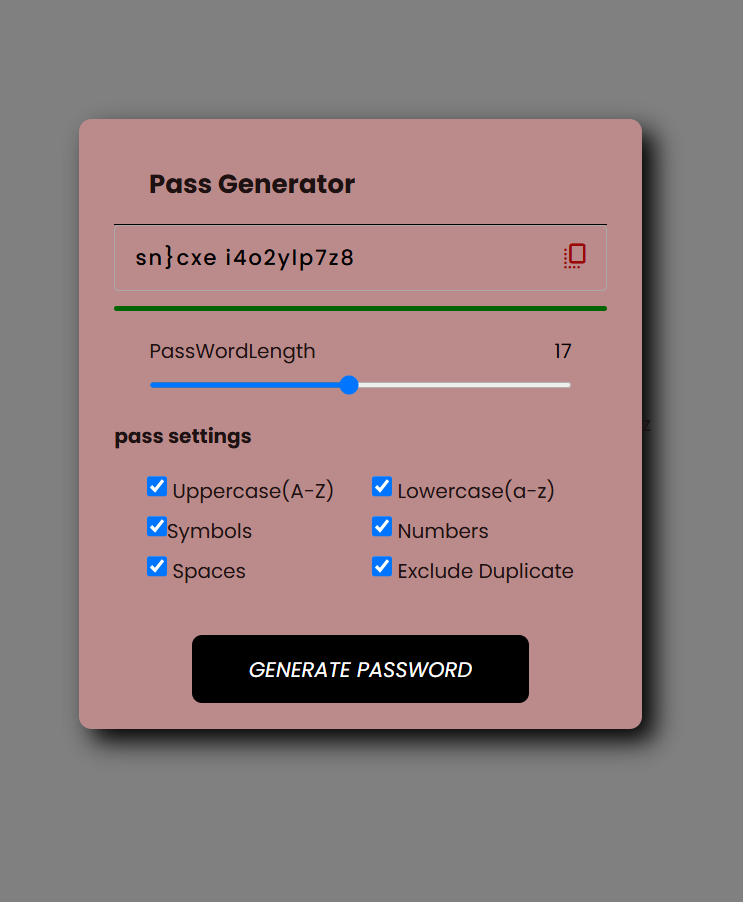

# 🔐 Strong Random Password Generator  

A secure and easy-to-use **password generator** that creates strong, random passwords to keep your accounts safe from cyber threats.  

## 🚀 Features  
✅ **Generate Strong Passwords** – Randomized and highly secure  
✅ **Customizable Length** – Choose your desired password length  
✅ **Include/Exclude Characters** – Numbers, symbols, uppercase, and lowercase letters  
✅ **Copy to Clipboard** – One-click password copying  
✅ **Responsive & User-Friendly** – Works on desktop and mobile  

## 🛠 Technologies Used  
- **Frontend:** HTML, CSS, JavaScript  
- **(Optional) Backend:** Node.js, Express.js for secure password storage  

## 📦 Installation & Usage  

### 1️⃣ Clone the Repository  
```sh
git clone https://github.com/KIHs0/password-generator.git
